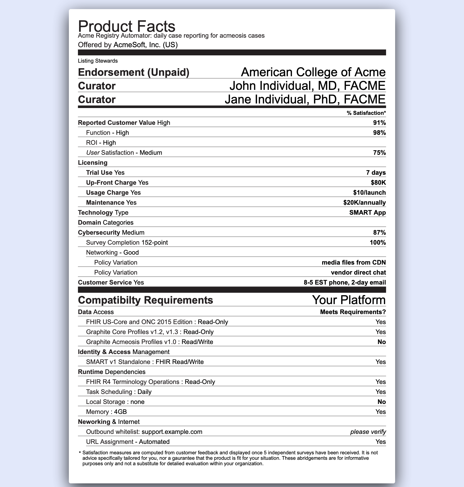
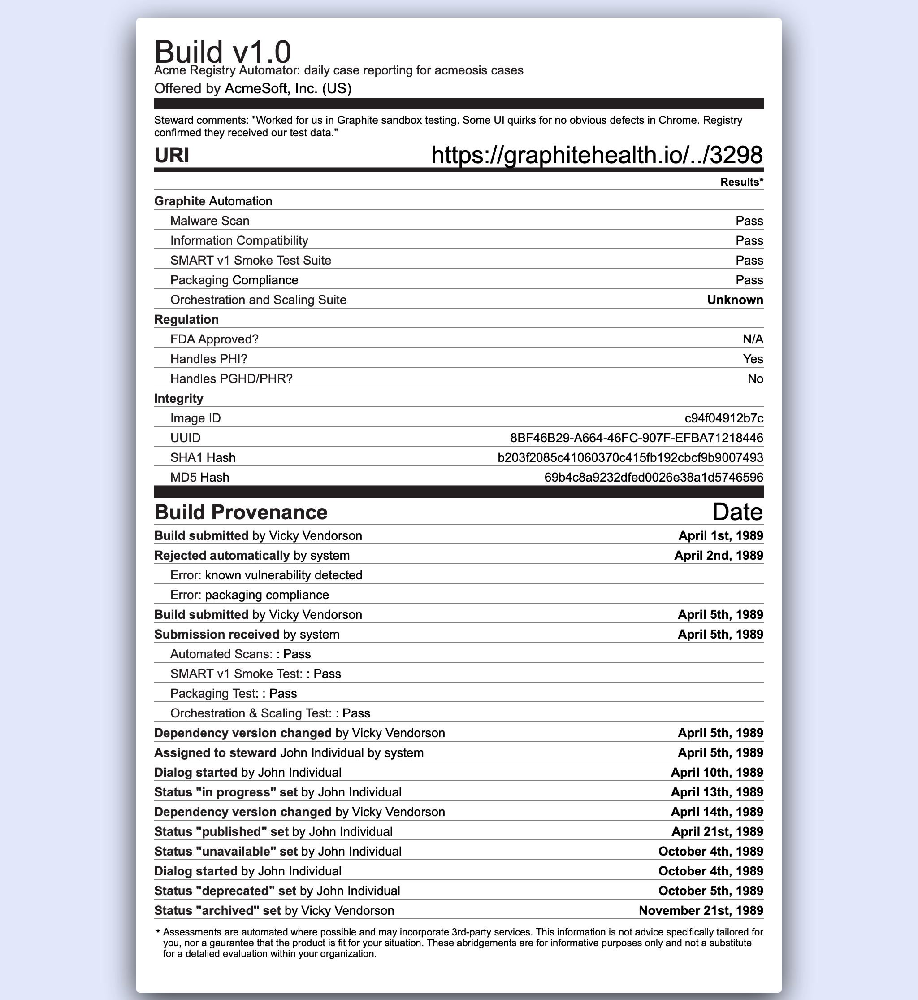

# Product Packaging and Metadata

Every Product submitted to a Marketplace implementation MUST be accompanied by a computable `marketplace.json` metadata file with a minimal core set of common, required elements. Most others fields are optional and highly dependent on the:

 * Technology standard type used by the given product
 * Requirements of the Marketplace operator
 * Regulatory factors and policies of stakeholder locales

This JSON metadata file is distributed alongside Product Build images to consumers or platform Agents, and is critical for marketplaces needing to:

 * Render concise product labels
 * Summerize policy conformance to an operator's official guidelines
 * Capture software chain of custody, cryptographic signing, provenence and audit trails between and vendor and consumers.
 * Detail licensing and pricing criteria, when applicable
 * Determine if a Product is compatible with a particular runtime platform
 * Provide remediation measures when runtime incompatibilities are detected  
 * Automate Product deployments in conjunction with runtime service orchestrators

## JSON Schemas

The top-level metadata schema applies at the _Build_ level. Every Product is expected to naturally evolve across each Build. We provide the schema in computable [JSON Schema](https://json-schema.org) format with inline documentation that can be viewed manually or by many supported editors.

[`marketplace.json` JSON Schema](../metadata/schema/build.json)

Internally referenced schemas:

 * [Label Schema](../metadata/schema/label.json)
 * [Dependency Schema](../metadata/schema/dependency.json)
 * [Task Schema](../metadata/schema/task.json)

## JSON Examples

The below examples _are not real products_ and are only for illustrative use on how `marketplace.json` metadata may be combined with known user information to improve consumer awareness of individual Products. We include them as directional guidance for implementors and product developers as a concrete starting point. For local product development and build purposes, the metadata file MUST be named `marketplace.json` and SHOULD be included at the root level of source code projects for compatible IDEs and editors. Marketplace operators may read a submitted `marketplace.json` file and merge in information with known consumer capabilities to provide a clear, objective overview of the Product and Build.

Note: While the schema permits flexible element ordering for readability, all cryptographic signatures of a `marketplace.json` document MUST operate on the _canonical JSON_ form. Assure you have rendered to canonical JSON before computing any hashes!

 * [CDS-Hooks Product Build Example](../metadata/example/cds-hooks.product.build.json)
 * [SMART-on-FHIR Product Build Example](../metadata/example/smart.product.build.json)
 * [CQL Product Build Example](../metadata/example/cql.product.build.json)
 * [Content Product Build Example](../metadata/example/content.product.build.json)

## Product/Build Label Visual Examples

Similarly to the JSON examples, the below images _are not real products_ and are not part of the formal specification. They are for conceptual purposes only. The International Organization for Standardization (ISO) has published a conceptually similar "Health and Wellness Apps - Quality and Reliability" labeling and quality metric specification via [ISO 82304-2:2021](https://www.iso.org/obp/ui/#iso:std:iso:ts:82304:-2:ed-1:v1:en). A core difference is that the ISO label prescriptively defines how software quality is measured for purposes of "scoring" every product, wherein the below examples are intended to keep a Marketplace operator as objective as possible, provide flexibility on how measures are produced, and avoid claims as to a Product's "fitness for purpose". The below examples also use visual design cues from the U.S. Food & Drug Administration (FDA) "Nutrition Facts Label". (These are not FDA products nor are they endorsed by the FDA.) 

### Exemplar Product Label Concept

### Exemplar Build Label Concept

